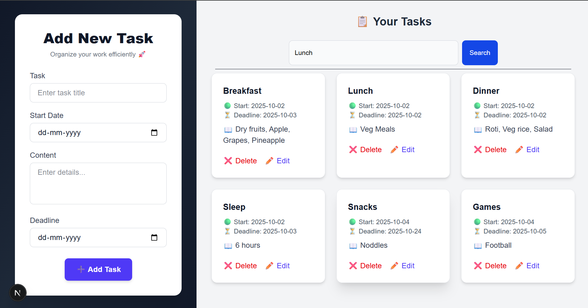

# 📝 Task Manager

A full-stack **Task Management Application** that allows users to **create, read, update, delete, and search tasks** with secure authentication.  
Built with a modern stack: **Next.js** (frontend), **Node.js + Express.js** (backend), and **MongoDB with Mongoose** (database).  

---

## 🚀 Tech Stack

- **Frontend**: [Next.js](https://nextjs.org/)  
- **Backend**: [Node.js](https://nodejs.org/), [Express.js](https://expressjs.com/)  
- **Database**: [MongoDB](https://www.mongodb.com/) with [Mongoose](https://mongoosejs.com/)  
- **Architecture**: MVC (Model–View–Controller)  

---

## ✨ Features

- 🔐 **User Authentication**  
  - Login & Logout functionality for secure access  

- ✅ **Task Management (CRUD)**  
  - Create new tasks  
  - Read tasks (view list of all tasks)  
  - Edit & Update tasks easily  
  - Delete tasks  

- 🔎 **Search**  
  - Quickly find tasks by title or content  

- 📂 **MVC Architecture**  
  - Clean separation of concerns for maintainable code  

---

## 🖼️ Screenshots
➕ Add Task Page
  

---

## ⚙️ Installation & Setup

Follow these steps to run the project locally:

### 1. Clone the repository
```bash
git clone https://github.com/your-username/task-manager.git
cd task-manager
2. Install dependencies
Backend
cd backend
npm install

Frontend
cd frontend
npm install

3. Setup environment variables

Create a .env file inside the backend folder with the following:

PORT=5000
MONGO_URI=your-mongodb-uri
JWT_SECRET=your-secret-key

4. Run the project
Backend
cd backend
npm run dev

Frontend
cd frontend
npm run dev


The app should now be running at http://localhost:3000

📂 Project Structure
task-manager/
│
├── frontend/          # Next.js frontend
│   ├── pages/         # App pages
│   ├── components/    # Reusable UI components
│   └── ...
│
├── backend/           # Node.js + Express backend
│   ├── models/        # Mongoose models
│   ├── controllers/   # Express controllers (business logic)
│   ├── routes/        # API routes
│   └── ...
│
└── README.md

🛠️ Future Enhancements

Task prioritization (High/Medium/Low)

Task categories or tags

User profile management

Dark mode UI

🤝 Contributing

Contributions, issues, and feature requests are welcome!
Feel free to fork this repo and submit a pull request.

📜 License

This project is licensed under the MIT License.

👨‍💻 Author

Vishal Gaurav
Full Stack Developer
LinkedIn
 | GitHub


---

Do you want me to also **make badges** (like GitHub stars, license, Next.js, Node.js, MongoDB badges) at the top to make it look more professional?